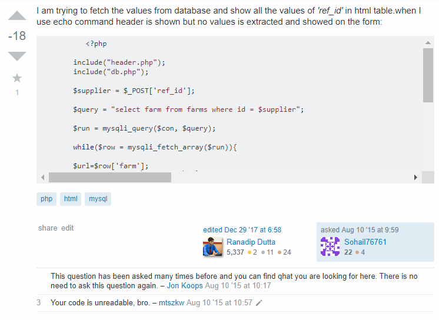
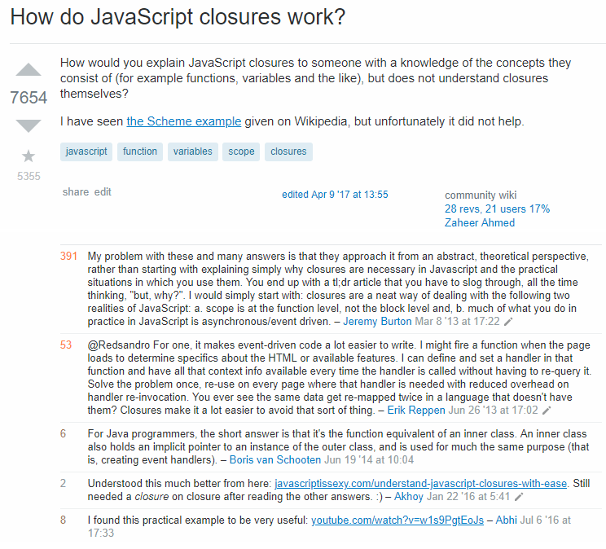

## Smart Questions
  I like to follow three rules when asking questions on forums like stackoverflow.com. First, be clear and appropriate.  The better others understand your problem, the easier and more precisely they can answer your question, and posting in the appropriate forum section and with the appropriate tags is the minimum clarity required to get an answer.  Not only does clarity increase the quality of the answer but also decreases the time to receive that answer.
  
  Secondly, demonstrate effort and knowledge.  Before going on a forum to ask a question, an attempt to answer that question should have been made.  When asking your question, mention the steps you took to answer it yourself, and demonstrate your knowledge or where your knowledge fell short.  This rule has two main purposes. One, it implies that you have already looked for an answer, so people are more willing to help you. Second, if people know how you are thinking about the question, it is easier for them to point out the error in your logic or fill in the knowledge gap needed to answer the question.
  
  Lastly, be respectful. This is the most obvious rule and applies not just to questions but any communications that can be linked to your professional persona.  These forums are communities that can generate contacts and opportunities for your career, so put your best face forward.  With the large growth in popular forums, these rules have become less about getting answers because with so many people on even the worst questions get answers, and with heavy moderation all the negative responses are stripped away. However, these rules have become even more important to earning respect amongst your online peers and improving your career.

## Examples

In this <a href="https://stackoverflow.com/questions/31916639/want-to-fetch-data-from-mysql-database-and-show-the-data-in-html-table">example</a>, the worst offense is he or she didn't demonstrate effort or knowledge.  In fact, this person most likley didn't even try to answer their own question as the first response shows that there are many duplicate questions already answered.  Clarity was also a problem with the messy code block and too much whitespace.

<a href="https://stackoverflow.com/questions/111102/how-do-javascript-closures-work?rq=1">This</a> is an example of a simple but good question. Clarity isn't an issue because it's an open-ended question, but this person clearly demonstrates their level of knowledge and shows effort by linking to an external resource that they read but couldn't understand.

  The difference in the comments of the 'bad' and 'good' question are obvious.  The good question even seemed to strike upon a common sore spot that people were having trouble understanding the academic explanations of closures.  The answer for that questions is a nice long community post that makes understanding closures very simple. For the bad question, offered a snippet of code to fix his problem, so while he probably got what he wanted he probably didn't learn anything.

