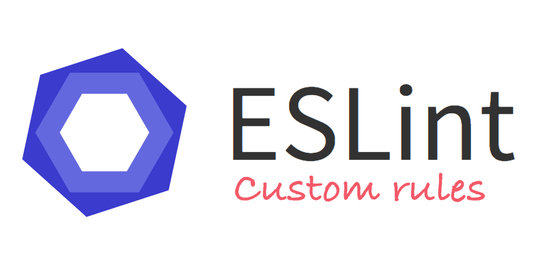

Coding standards are one of the most important tools for software development. With tools like ESlint, implementing coding standards is easier than ever.  The benefits of implementing coding standards might be not as obvious for personal projects, but the benefits are clear for any software development with collaborators.

## Readability

The most obvious benefit from using coding standards is the readability of code.  Proper indentation creates a visual shorthand for the brain to understand code without having to process every character on the screen.  In addition, the coding standard creates a common look and navigation to code, so multiple people working on the same code don’t get thrown off when something is out of place.

## Quality

Coding standards also can improve the quality of code.  By following certain coding standards, bad code that is syntactically correct can be avoided.  For examples, declaring all variables at the top of the code prevents them being used before they are declared.  Extra code or errors are pointed out when data is assigned but not used, and I have found that fixing problem as they are pointed out can help guide me to what I need to code next.

In conclusion, coding standard will benefit any software development and should be implemented for any project.  The improved readability and quality leads to better efficiency, which saves time, and time is money.  With the freedom of JavaScript, coding standards are especially important to making sure the code performs well across all browsers by using the best method for certain functions.  

