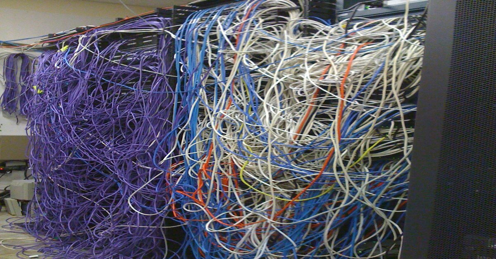
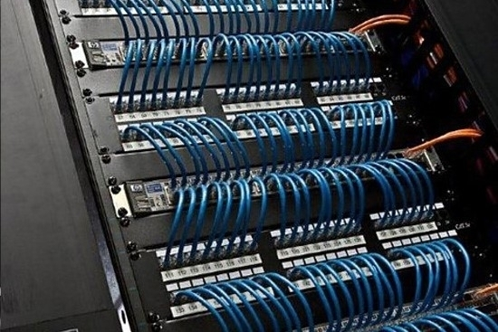

## Project

When one of my employers was bought by a mainland investment firm, the network was a patchwork mess. They heavily invested in getting the company's network to be PCI compliant. PCI is a standard for networks that host credit card information or conduct credit card transactions.  There was a laundry list of network upgrades that went into the project.  The old network was so far gone that we built a new network from scratch.  As part of that we upgraded most of our client and server software, and added new system logging and email managment software to enhance security.

## Involvment
I did a wide array of work on this project, from clearning up patch panels to deploying new client-server software.  I was responsible for making sure all the network equipment was cleanly patched and physically secured at each property.  I helped deploy the new network equipment. I helped to migrate users, computers, printers, and servers to the new network.  I troubleshot various issues with the network in conjunction with our engineers.  I recongiured printers to work with the new network and disabled services using unsecure protocols.  I really just did whatever our engineers didn't have time for or our technicians needed help with.

I learned a lot about project mangament from watching what worked and what didn't.  Communication was very important to ensure work wasn't repeated and time wasn't wasted waiting for other work to be done.  Setting and keeping deadlines was important, but the most important aspect was communicating with the users because we don't want to interfere with their ability to serve customers, and unforseen problems can arrise if we don't properly communicate the changes we are making.  For example, we added webcams to every room with secured network equipment. Unfortunetly, it was unknown to us that employees used one of those rooms for changing. One can imagine the fallout when the employees noticed the newly installed camera.  As for the technical side of things, the most interesting part for me was learning about the latest firewall technology and working with the new virtual servers.

