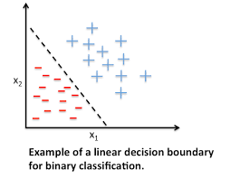
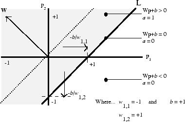

## Overview

In machine learning, one of the simplest problems is binary classification of linerally seperable data, and the perceptron learning algorithm is the simplest method to solve this problem.  Using the properties of the dot product of two vectors, a descision boundry can be created where the sign of the dot product of an input vector and a weight vector classifies the data.

The picture above shows how the perceptron algorithm works for a two-dimensional input vector.  The dimensions of the input vector correlate to different properties that can be used to classify the objects like size, color, location, distance, etc.  The perceptron is trained with training data that lists has the properties and a label that classfies the input.  Using this training data, the perceptron adjusts the weight vector until it properly classifies the training data.  The trained perceptron can then be used to classify unlabeled data.

The learning comes from the adjustment of the weight vector with the training data. The human equivalent would be being shown different examples of a square and then being able tell what objects are square in the future.  The perceptron has its roots as a simplified model of the neuron and still is relevant as a basic unit in neural networks.

## Experience

I worked on this project by myself over the course of my introduction to machine learning class.  I coded the learning algorthm, the data generator, and graphed the results for analysis.  I coded this in C on the UH unix platform and learned that it is not the best language for quick iteration and information analysis.  My peers had a lot easier time using python as it had readily avaible and easy to use tools for data representation.

One of the most interesting aspects of this program was the process of debugging the software.  The perceptron's theoretical model means as the number of random data points increases so does the accuracy of the descision boundry and that over a large number of runs the average error should approach the theortical. But my data was showing that everytime I ran the program, no matter how many runs I had, the data would have large variances.  I eventually figured out that because of the way the random seed was generated, the "random data" wouldn't actually change from one run to the next.  It was the first time dealing with a bug that dealt with so much data it would be hard to catch directly, and I had to indirectly find it from statisticlly analyzing the data output.

You can see my project <a href="../files/Perceptron Project.pdf">here</a>.

